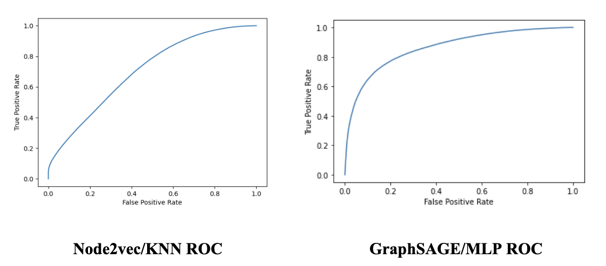

<em>Graph structure</em>

# Motivation
With the rise of music streaming services on the internet in the 2010’s, many have moved away from radio stations to streaming services like Spotify and Apple Music. This shift offers more specificity and personalization to users’ listening experiences, especially with the ability to create playlists of whatever songs that they wish. Oftentimes user playlists have a similar genre or theme between each song, and some streaming services like Spotify offer recommendations to expand a user’s existing playlist based on the songs in it. Using Node2vec and GraphSAGE graph neural network methods, we set out to create a recommender system for songs to add to an existing playlist by drawing information from a vast graph of songs we built from playlist co-occurrences (edges between two songs that exist in the same playlist). The result is a personalized song recommender based not only on Spotify’s community of playlist creators, but also the specific features within a song.

# Data
Our song song recommendation system will work with any music dataset that contains a community of users with playlists that they have created. The most popular of these would likely come from Apple Music, Spotify, Youtube, or Amazon as they are by far the most used music streaming services in America (that support playlist creation) as of January 2021. In all the markets Spotify and Youtube contend for the most used, but Youtube is not solely a music streaming service, and they do not release data for public use as readily as Spotify does, so we chose to go with Spotify as our dataset.

In January 2018, Spotify released a vast dataset containing 1 million playlists created by users between January 2010, and October 2017 for the purpose of an online data competition to try to predict subsequent tracks within a playlist. Though the competition is over, we used this dataset of user’s playlists to try to create personalized recommendations for a user’s playlist. Currently we have taken the first ten thousand playlists from this dataset to train our model on, though scaling up to include more playlists (and subsequently songs) is possible, but currently not necessary for us to demonstrate the efficacy of this recommender. 

  

<em>Sample playlist format</em>

Additionally we used Spotify's API to obtain various musical features of songs in order to enrich the recommender to learn from not only the graph structure we created for songs, but also learn from unique aspects of the songs themselves. Some of these features include acousticness, instrumentalness, and danceability as described by Spotify and their algorithmic scoring of such categories.

# Features
### Song Attributes

From these ten thousand playlists, we extracted all of the unique songs, which comes out to around 170,000 unique songs. We then utilized the Spotify developer public API to query information about each of these songs and obtain features for our model. These features include Spotify’s own extracted numerical data from each song, of which we kept the following:

- Danceability (Numerical) - How suitable a track is for dancing.
- Energy (Numerical) - Intensity and activity.
- Loudness (Numerical) - Overall loudness of a track in decibels. 
- Speechiness (Numerical) - Presence of spoken words in a track.
- Acousticness (Numerical) - How acoustic the track is.
- Instrumentalness (Numerical) - How instrumental the track is.
- Liveness (Numerical) - The presence of an audience in the recording.
- Valence (Numerical) - The musical positiveness conveyed by a track.
- Tempo (Numerical) - Estimated tempo in beats per minute.
- Duration (Numerical) - Duration of the song in milliseconds.
- Key (Categorical) - The key that the track is in.
- Mode (Categorical) - Major or minor modality of a track.
- Time Signature (Categorical) - Estimate of time signature.

For our recommender system to successfully provide personalized recommendations, we work under the assumption that when users create playlists manually, they generally will add songs that are similar to each other in some ways. A playlist could be comprised of songs pertaining to a specific genre like dance music or r&b, but it could also reflect a specific mood like happy songs that make you want to dance, or quiet sad songs. So within a playlist, we would expect the measures of the features above to be quite close to each other.

# Graph
The graph we created consists of about 170,000 nodes corresponding to each unique song, and a vast set of edges connecting the songs that appear in a playlist from the first 10,000 playlists we selected. To create an effective recommender, we needed a way to rank the closeness of two songs, so as our aggregate we decided on co-occurrence of songs within playlists as the edges between them with a weight on each edge representing the amount of co-occurrences across all playlists. We chose co-occurrence for our graph because we want to capture node neighborhoods of songs that are alike for our recommender, and we assume that people will create playlists of songs that are at least somewhat alike. We believe this is sufficient for this purpose, but with future optimizations and time to re-create graph structure, trying different methods for graph creation could yield potentially beneficial results. Each node also contains a feature set of the features that are described above. With weighted edges and node features, we would have enough data to create a personalized link prediction problem. Our result was a weighted adjacency matrix with the following measures:
  

  

<em>Graph stats</em>

Below you can see how the graph structure is in an image. The co-occurences are counted by edge and the red edge in this case would have a weight = 2 due to co-occurence happening in 2 different playlists. All other black edges would have a weight = 1.
  

  

<em>Graph structure</em>

# Embeddings
### Node2Vec
One of the earlier graph-based methods is the Node2Vec which uses biased random walks to create low dimensional space representations for nodes. This algorithm aims to preserve node neighborhood networks for the node embeddings and it allows for more accurate classification on nodes because of these neighborhoods. The algorithm utilizes biased 2nd order random walks at the core of its algorithm with p and q tunable parameters to determine the probability of each node subsequent from the original of being visited. Tuning of these parameters allows for the user’s choice of having a more local walk emulating bread-first sampling, or a more explorative walk emulating depth-first sampling. The p parameter determines the probability of a node being revisited right after a step, where a high value makes it less likely that the node is revisited, promoting a depth-first random walk. The q parameter controls the probabilities of stepping to an unvisited node, where a higher value is biased towards local nodes and a smaller value promotes visiting nodes farther from the original.

  

<em>Visualization of the node2vec random walk. “t” is the starting node, “v” is the current node in the random walk.</em>

### GraphSAGE
GraphSAGE is a framework for node embeddings that separates itself from existing transductive methods that require every node to be present in the training process by proposing an inductive approach to create node embeddings. This is a much more scalable approach that is ideal for large networks that don’t all fit into memory, and that can be continuously updated. The graphSAGE algorithm’s inductive ability comes from its use of neighborhood feature aggregation for a node to create an embedding for that node that will capture information about its neighborhood. Aggregation can be done in a number of ways, the most common being LSTM, mean, pooling aggregator functions. Depending on the aggregator chosen, graphSAGE will capture different information from its neighboring nodes. It is the neighborhood aggregation that makes it so that when a new node is added to the graph, its embedding can be generated from its features and neighboring nodes, rather than having to create new embeddings using the entire graph structure over again.

  

<em>Visualization of feature aggregation from a node’s neighborhood.</em>

# Recommenders
### K-Nearest Neighbors (KNN) on Node2Vec Embeddings
As a baseline model, we built Node2Vec embeddings for songs in the graph based on the weighted connections of co-occurrences in playlists that existed. Using these node embeddings, we fed them into a K-Nearest Neighbor model to find similar embeddings to serve as recommended songs for each song. We explored this model because this is a common method used to encode graph data into a single feature set alongside song features and doesn’t suffer from scalability issues like Graph Convolutional Networks do. It also was able to account for weighted edges that we created in our song graph. After finding similar embeddings for each song, we treated those as predicted edges to evaluate against ground truth to compute precision and recall metrics. We also aggregated the closest embeddings to be incorporated into a recommender. Some drawbacks we expected were performance and accuracy of Node2Vec embeddings in representing neighborhoods as well as runtime issues when computing K-Nearest Neighbor on heavily connected songs with high degrees.

### Link Prediction Ranking on GraphSAGE Embeddings
With the trained embeddings of songs in hand, given a playlist with k seed tracks, for each seed track s and each the candidate track c for recommendation, we will feed the embeddings of s and c into the predictor to compute the predicted scores, which indicates the probability of a edge existing in between. After computing the scores for each seed song, we rank the scores in descending order and prioritize the recommendation of those songs that have the highest probability of a link with the seed tracks. Since there are many possible candidate tracks, we chose the candidates from existing edges and ranked them based on the prediciton scores.

# Results
### Link Prediction Metrics

  

<em>Link Prediction Metrics</em>

After running these two models and their respective embeddings, we found that the GraphSAGE embeddings with the MLP predictor gave the highest accuracy. This is as expected, as Node2vec embeddings are quite a bit less complex than the convolutional learning layers that are used in the GraphSAGE embeddings. The high precision entailed that the model was good at predicting edges between songs that should exist for a given song and limited false positives overall. We were more interested in recall as it told us the ratio of predictions out of all edges that do exist between songs. This was important as we believed the strongest recommender would first pull from existing edges that come from a song but aren’t necessarily in a given playlist yet. We saw improvement in both categories and also saw higher AUC scores in GraphSAGE - MLP. The AUC score increase showed better performance in predicting true positives and true negatives over all the data. We can also see this in the ROC curves below that show GraphSAGE - MLP to have a curve closer to the top left than the Node2vec - KNN curve.

  

<em>ROC Curves</em>

### Playlist Recommendation Results
All of the following are done on recommendation sets for 200 random playlists. The recommendations are done as sets of the top recommended songs for each unique song in the playlist. For the example below, each song in the playlist has one song in the recommendations list that is the top song to recommend to it that isn’t already in the playlist.

File Location: data/mpd.slice.9000-9999.json
Name: ‘Happy :)’
Pid: 9360

Playlist:
- Lisztomania - Phoenix
- Rabid Animal - Lake Street Dive
- Dancing On Quicksand - Bad Suns
- The Sweet Escape - Gwen Stefani
- Ants Marching - Dave Matthews Band
- Rock the Casbah - Remastered
- Stare Into The Sun - Graffiti6
- Feel It Still - Portugal. The Man
- anywayican - WALK THE MOON

Recommendations:
- John Cougar, John Deere, John 3:16 - Keith Urban
- The Tiki, Tiki, Tiki Room — The Mellomen
- Crazy In Love (feat. Jay-Z) — Beyonce
- Woman — Harry Styles
- Sweet Caroline — Neil Diamond
- Before You Start Your Day — Twenty One Pilots
- X (feat. Future) — 21 Savage
- Rock and Roll All Nite  — KISS
- T-Shirt — Migos
- HUMBLE. — Kendrick lamar

### Feature Distribution in Recommendations

The following tables and histograms are drawn from taking the variance, average, average difference of numerical features in consecutive song pairs, and difference in range from the original playlists and from the recommended sets. The differences between these measures are then taken and the resulting distribution is plotted, indicating the difference in measures for each audio feature. The table shows the average of the distribution of differences for each measure as well.

  

<em>Distribution of Differences for Song Features</em>

In general, we saw that little change in the features between the recommended song sets. For most of the variance and average differences the majority of the distribution was below 0.1, especially for the variance of danceability, energy, acousticness, valence, and liveness. There were, however, a few features that did seem to change more between the recommended song sets, such as tempo and duration. These two features were somewhat expected to have a more spread out distribution, as one would not typically expect a playlist to have songs of all very similar length and tempo. Speechiness was the least changing feature, which was a good sign, because oftentimes very speechy playlists consist of rap-heavy songs, and so the recommended songs seemed to reflect that. 

For future iterations of the model, it may be beneficial to try training with some of the less relevant features like duration and tempo removed. At the moment we keep them in to see if they can capture more playlist information.

# Discussion
We set out to use graph based methods to create Spotify song recommendations for playlists and found promising results overall. We first looked at link prediction metrics to determine how our model performed at finding edges that should already exist between songs as co-occurrence in playlists. The significant boost in AUC score, precision, and recall in GraphSAGE over Node2Vec gave us confidence that more of the graph structure was being learned and potential recommendations as a result could be more useful going forward. We think Node2Vec-KNN did worse, probably due to the embeddings created by Node2Vec not being accurate enough. In this highly connected graph, the random walks could have varied significantly enough to cause the vector embeddings to be less representative of the graph. The intent was to better encode the graph structure using strategies like GraphSAGE while also retaining song specific features that could traditionally help in song recommendation as we assumed similar songs had less variance in features such as acousticness, beats per minute, or danceability. 

When it came to seeing the playlist recommendation results and the actual tracks that were recommended based on the top candidate tracks for each given song in a sample playlist, we had mixed outcomes. In many cases, the model was able to recommend songs in similar genres, by similar artists, and even specific albums. In other cases, however, the recommendations tended towards largely popular songs and artists without much genre overlap as we wanted. We think this could be due to the highly connected nature of the graph and the heavier weights being put on edges connected to popular songs. In the GraphSAGE neighborhood sampling, songs with few edges may be close in proximity to popular songs through our heavily connected graph structure and thus could have similar neighborhoods even though genres and style might be vastly different. 

One thing we definitely would want to experiment with is different graph structures based on not only playlist co-occurrence, but also album or artist co-occurrence where edges exist between songs if they are in the same album or by the same artist. This would result in a heterogeneous graph that encodes varying weights of information in each edge. We also think that lowering the connectivity by creating edges in a more restrictive way could help with the GraphSAGE neighborhood sampling for less popular songs. Connectivity likely leads to higher importance on popular songs, especially for recommendations and we think the model could personalize better if it functioned on a more representative underlying graph.

For future improvements on obtaining node neighborhoods based on song features, we would like to incorporate a categorical feature that is representative of a song’s genre. This could however be somewhat problematic, as there has always been some debate around certain songs’ classification to certain genres already, and Spotify does not provide features about a song’s genre. Incorporation of such a feature could yield much better results, as many themed playlists seem to be centered around one or two similar genres. Future work could make use of a classification model for basic song genres, and utilize it in the preprocessing for playlist recommendation to add another categorical feature.

# Conclusion
The business case for this approach to playlist recommendation, is that once the graph is built, it is able to add new data concerning both new nodes and new playlists. GraphSAGE is an inductive approach; re-training of the entire model would not be required. Because Spotify is ever growing, obtaining new users and new songs from artists each day, an approach like this that can easily evolve with growth is needed. Our project provides somewhat of a proof of concept that playlist recommendation with inductive graph learning approaches works, though there is room for improvement. We feel like the idea works in certain instances very well and could help music distribution services find more powerful ways to personalize for users. We tried to put emphasis on not only naively recommending songs from the same artists but also allowing discovery and different styled songs to surface as new avenues to explore.

